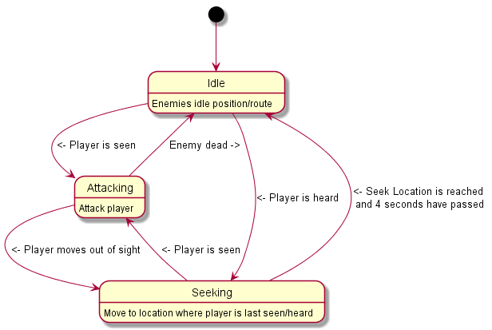

# Phoneline Cincinnati 3D

Hotline Miami style 3D game for my final year project. The MVP needs to have at least one playable level, with the release going to have **at least** the same amount of levels as the actual game. The game will be programmed in Java with OpenGL as the graphics library.

Project is to make a Doom-Like game

##### Story Overlook

The game is set in an alternate 1989, and the Russian mafia have overtaken the slowly dying Italian-American Mafia in Cincinnati, and have seized the drug market. The player <Character yet to be named> is a simple mechanic that just moved into the city and started receiving strange phone calls from an organisation known as the hotline. The phone calls ask him to try and take out the mafia. Naturally they ignore the phone calls but soon realise that the hotline are not to be messed with, and is eventually forced into a life of crime.

##### Look and feel

The game is meant to have a "Semi-true" 80s style and will feature synthwave music and have camera effects that give a grainy VHS look.

##### Required features
<u>Player:</u>
1. Smooth, fast movement
2. Ability to pick up many types of weapons as well as fight unarmed
3. Ability to throw a weapon forward in order to knock over enemies
4. Glory kill animations similar to the likes seen in brutal doom
5. Like Hotline Miami, The player can change masks to grant special abilities

<u>HUD:</u>
1. Hud elements displayed at the bottom of the screen similar to doom.
2. Protagonist face (or mask) displayed at the bottom (like doom) however is the **only** way to measure health
3. Weapon held displayed to the right of the face, along with ("LMB to throw weapon")
4. Mask info shown on the left of the face, along with any controls for active abilities

<u>Mafia mobsters:</u>
1. At least two types of mobsters: - Normal, can use weapons. - Large, unarmed, will kill in one hit
2. Large mafia mobsters will **always** need to be glory killed, any weapons (even guns) will only knock them over
3. Normal mobsters will be killed in one hit but can wield any weapon the player can.
4. Mobsters can only be glory killed while they are knocked on the floor **unless a mask says otherwise**

<u>Level types:<u>
1. Home - The players home, here they can choose to drive, go on a personal mission, or sleep. If they choose to sleep, they'll wake up to the phone ringing where they'll be assigned a hotline mission
2. Hotline mission - Player is required by the hotline to enter a mafia controlled building and kill all the inhabitants
3. Driving - Usually happens after a Hotline mission, but can also be chosen from the Home level for an endless driving level
4. Personal mission - Character building, mostly affected by player's choices in previous personal missions and in some cases the Hotline missions

##### Optional features
* Procedurally generated Hotline missions

### Mechanics in depth
##### Enemy states

